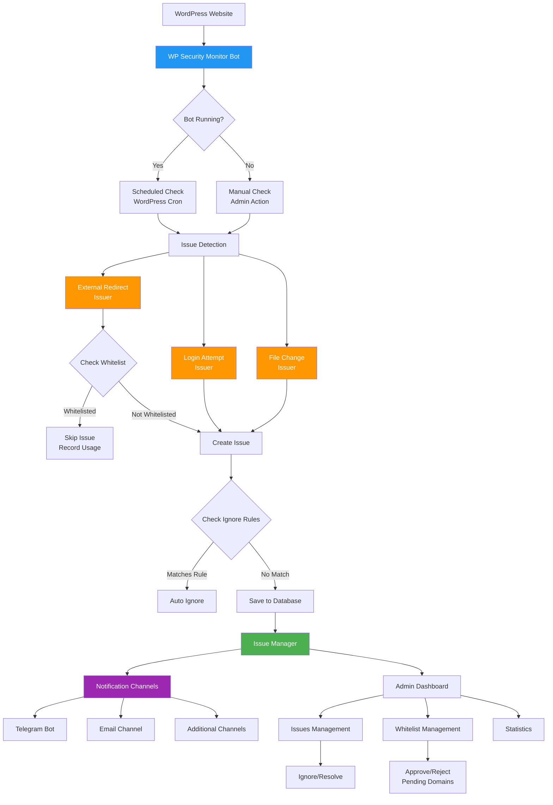
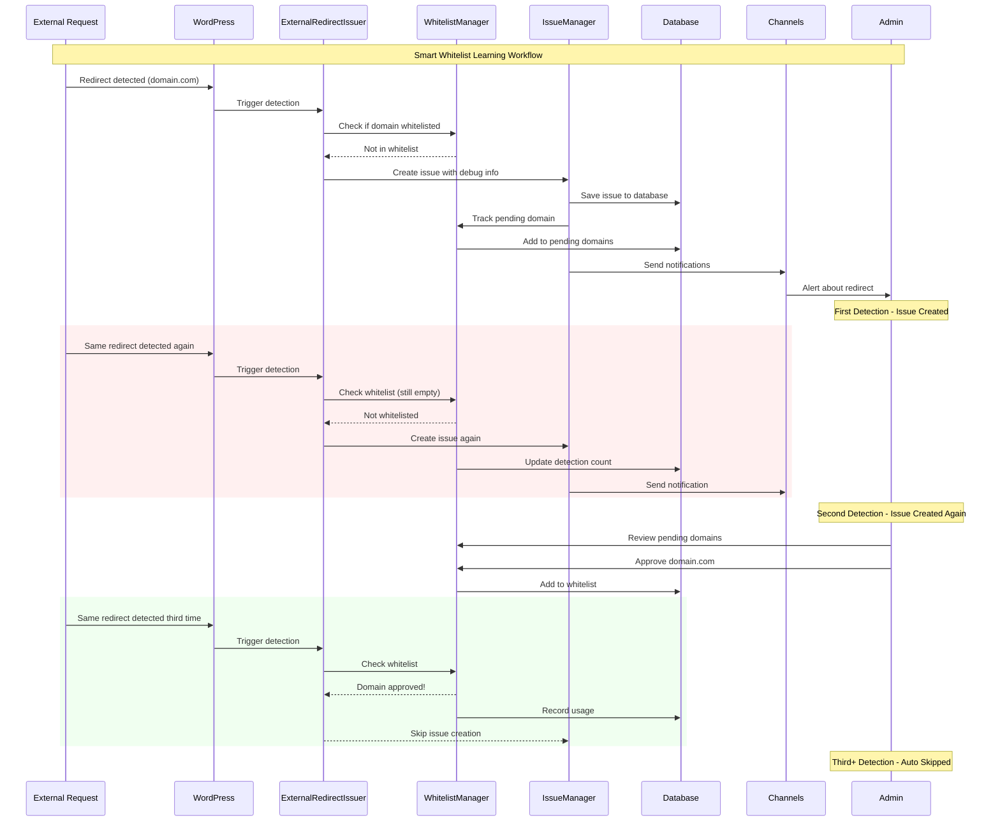
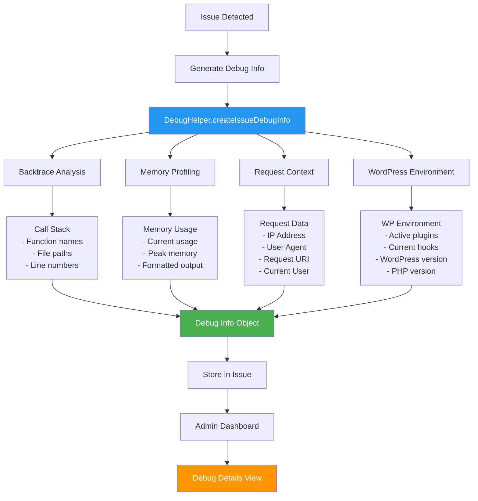
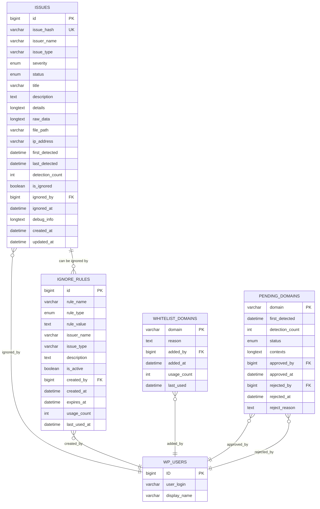

# WP Security Monitor Bot - Concept & Architecture

## 🎯 **Overview**

WP Security Monitor Bot là một hệ thống giám sát bảo mật WordPress tự động với khả năng học hỏi thông minh (Smart Learning). Plugin được thiết kế để phát hiện, theo dõi và quản lý các vấn đề bảo mật một cách proactive, giảm thiểu false positives thông qua AI-like learning system.

## 🏗️ **System Architecture**

### **Core Components Flow**

## 🧠 **Smart Learning System**

### **Whitelist Learning Workflow**

Plugin implement một hệ thống học thông minh để giảm false positives:

### **Learning Phases**

1. **Discovery Phase**: Lần đầu phát hiện → Tạo issue + Pending domain
2. **Confirmation Phase**: Lần thứ 2 → Tăng detection count, vẫn tạo issue
3. **Learning Phase**: Admin review → Approve/Reject decision
4. **Automation Phase**: Lần 3+ → Tự động skip hoặc continue dựa vào decision

## 🔍 **Advanced Debug System**

### **Debug Information Flow**

## 🗄️ **Database Schema**

### **Entity Relationship Diagram**

## 🔧 **Design Patterns**

### **1. Singleton Pattern**
- `Bot::getInstance()`
- `IssueManager::getInstance()`
- `WhitelistManager::getInstance()`

**Lý do**: Đảm bảo single instance và global access point.

### **2. Strategy Pattern**
- `ChannelInterface` implementations
- `IssuerInterface` implementations

**Lý do**: Dễ dàng thêm channels và issuers mới.

### **3. Observer Pattern**
- WordPress hooks system
- Issue detection events

**Lý do**: Loose coupling và event-driven architecture.

### **4. Factory Pattern** (Implicit)
- Dynamic issuer loading
- Channel configuration

**Lý do**: Flexible object creation.

## 📊 **Performance Considerations**

### **Database Optimization**
- **Indexed fields**: `issue_hash`, `issuer_name`, `severity`, `status`
- **Partitioning**: By date for large installations
- **Cleanup**: Automated old data removal

### **Memory Management**
- **Debug info tracking**: Monitor memory usage per check
- **Lazy loading**: Load issues on-demand
- **Pagination**: Large result sets

### **Scalability Features**
- **Configurable limits**: Max files to scan, check intervals
- **Throttling**: Prevent notification spam
- **Background processing**: WordPress Cron integration

## 🛡️ **Security Features**

### **Input Validation**
- All user inputs sanitized
- SQL injection prevention
- XSS protection

### **Access Control**
- `manage_options` capability required
- Nonce verification for all forms
- User tracking for audit

### **Data Protection**
- Sensitive data encryption options
- Debug info sanitization
- Personal data anonymization

## 🔮 **Future Enhancements**

### **Planned Features**
1. **Machine Learning**: Pattern recognition for new threat types
2. **API Integration**: External threat intelligence feeds
3. **Multi-site Support**: Centralized monitoring
4. **Real-time Alerts**: WebSocket notifications
5. **Custom Issuers**: Plugin-based extension system

### **Extensibility Points**
- Custom channel development
- Additional issuer types
- Webhook integrations
- Third-party tool integration

---

**Tài liệu này cung cấp overview về architecture và concept chính của WP Security Monitor Bot. Để hiểu chi tiết implementation, tham khảo các tài liệu chức năng cụ thể.**
